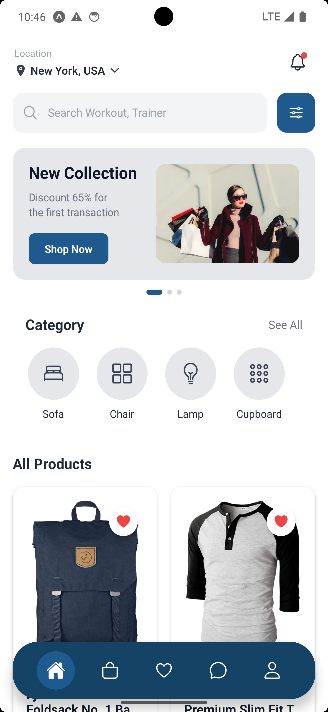
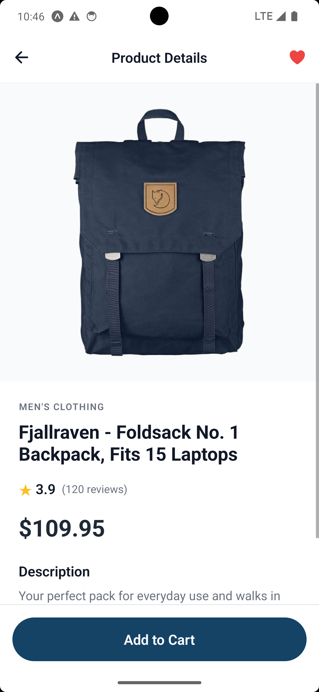
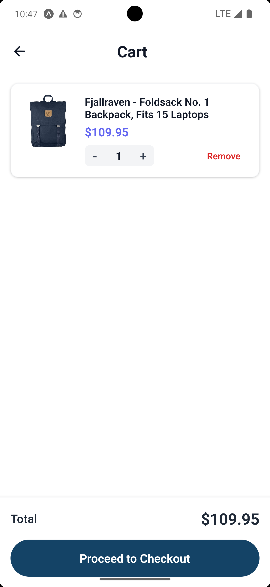
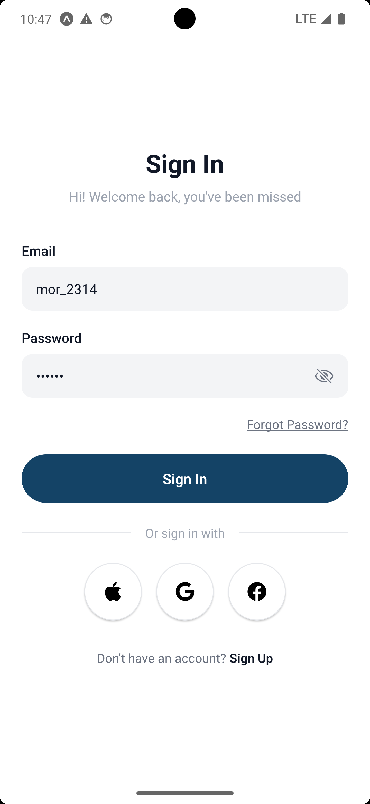
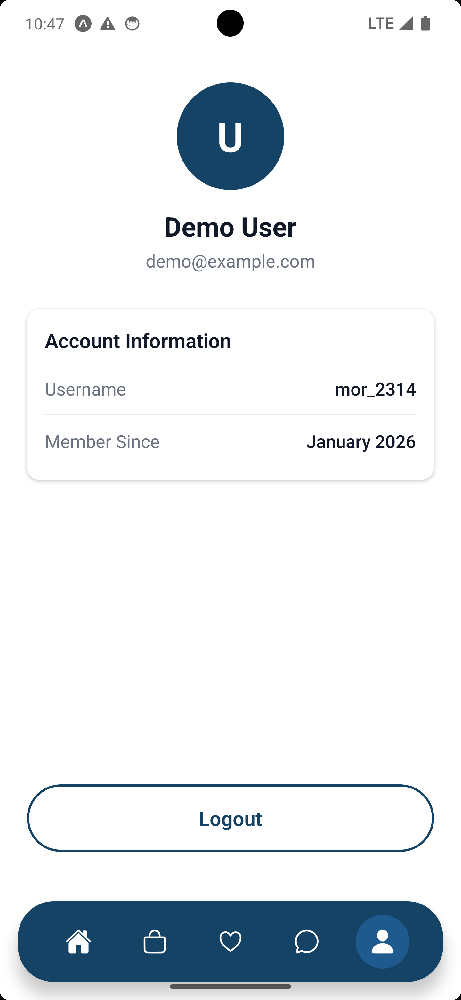
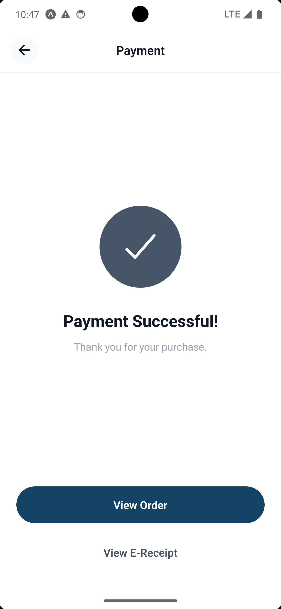

# 🛍️ Mobile E-Commerce App

A modern, production-ready e-commerce mobile application built with **React Native**, **Expo**, and **TypeScript**. Features a comprehensive theme system, beautiful UI design, and professional architecture.

## 📸 Screenshots

<table>
  <tr>
    <td width="50%">
      <h3 align="center">Home Screen</h3>
      
    </td>
    <td width="50%">
      <h3 align="center">Product Detail</h3>
      
    </td>
  </tr>
  <tr>
    <td width="50%">
      <h3 align="center">Shopping Cart</h3>
      
    </td>
    <td width="50%">
      <h3 align="center">Login Screen</h3>
      
    </td>
  </tr>
  <tr>
    <td width="50%">
      <h3 align="center">Profile Screen</h3>
      
    </td>
    <td width="50%">
      <h3 align="center">Checkout Success</h3>
      
    </td>
  </tr>
</table>

---

## ✨ Features

### 🎨 **Modern UI/UX**
- Beautiful, clean design with modern aesthetics
- Smooth animations and transitions
- Responsive layouts for all screen sizes
- Custom bottom navigation with active states
- Professional login screen with social login options
- Elegant checkout success screen

### 🔐 **Authentication**
- Secure login with persistent sessions
- Token-based authentication
- Secure storage using Expo SecureStore
- Protected routes and navigation guards

### 🛒 **Shopping Experience**
- Product catalog with images, prices, and ratings
- Product detail pages with full information
- Shopping cart with add/remove functionality
- Cart badge showing item count
- Wishlist/favorites functionality
- Checkout flow with success confirmation

### 🎨 **Theme System**
- **Centralized color management** - Change entire app theme from one place
- **Comprehensive design tokens** - Colors, spacing, font sizes, border radius
- **Shadow presets** - Consistent shadows across components
- **Easy customization** - Update primary color and see changes everywhere
- **Type-safe** - Full TypeScript support for all theme tokens

### ⚡ **Performance & State Management**
- React Query for efficient server state management
- Zustand for client state (cart, auth, wishlist)
- Automatic caching and background refetching
- Optimistic updates for better UX
- Pull-to-refresh functionality

### 📱 **Navigation**
- File-based routing with Expo Router
- Tab navigation for main screens
- Stack navigation for detail views
- Deep linking support
- Smooth transitions

## 🛠️ Tech Stack

### Core
- **React Native** - Cross-platform mobile framework
- **Expo** (SDK 52) - Development platform and tooling
- **TypeScript** - Type-safe development

### State Management & Data Fetching
- **React Query** (@tanstack/react-query) - Server state management
- **Zustand** - Client state management (cart, auth, wishlist)

### Networking
- **Axios** - HTTP client with interceptors
- **Fake Store API** - Mock e-commerce backend

### UI & Styling
- **Custom Theme System** - Centralized design tokens
- **Expo Router** - File-based routing
- **React Native Safe Area Context** - Safe area handling
- **Expo Vector Icons** (Ionicons) - Icon library

### Storage
- **Expo SecureStore** - Secure token storage
- **AsyncStorage** - Local data persistence

## 📁 Project Structure

```
expo-ecommerce/
├── src/
│   ├── app/                      # Expo Router screens
│   │   ├── (auth)/              # Authentication flow
│   │   │   ├── _layout.tsx
│   │   │   └── login.tsx        # Modern login screen
│   │   ├── (tabs)/              # Main tab navigation
│   │   │   ├── _layout.tsx
│   │   │   ├── index.tsx        # Home/Products
│   │   │   ├── cart.tsx         # Shopping cart
│   │   │   ├── favorites.tsx    # Wishlist
│   │   │   └── profile.tsx      # User profile
│   │   ├── product/
│   │   │   └── [id].tsx         # Product detail
│   │   ├── checkout.tsx         # Checkout flow
│   │   ├── checkout-success.tsx # Success screen
│   │   ├── messages.tsx         # Messages (placeholder)
│   │   ├── _layout.tsx          # Root layout
│   │   └── index.tsx            # Entry point
│   │
│   ├── components/              # Reusable components
│   │   ├── common/             # Common UI components
│   │   │   ├── Button.tsx      # Themed button component
│   │   │   ├── Loading.tsx     # Loading spinner
│   │   │   └── ErrorState.tsx  # Error display
│   │   ├── product/
│   │   │   └── ProductCard.tsx # Product card with wishlist
│   │   ├── cart/
│   │   │   └── CartItemCard.tsx
│   │   ├── home/               # Home screen components
│   │   │   ├── SearchBar.tsx
│   │   │   ├── BannerSlideshow.tsx
│   │   │   ├── CategorySection.tsx
│   │   │   └── LocationHeader.tsx
│   │   └── navigation/
│   │       └── CustomBottomNav.tsx
│   │
│   ├── features/               # Feature modules
│   │   ├── auth/
│   │   │   └── authStore.ts   # Authentication state
│   │   ├── cart/
│   │   │   └── cartStore.ts   # Shopping cart state
│   │   └── wishlist/
│   │       └── wishlistStore.ts
│   │
│   ├── services/              # API services
│   │   ├── api.ts            # Axios instance & interceptors
│   │   ├── endpoints.ts      # API endpoint definitions
│   │   └── index.ts
│   │
│   ├── hooks/                # Custom hooks
│   │   └── useApi.ts        # React Query hooks
│   │
│   ├── constants/           # App constants
│   │   ├── colors.ts       # Theme system (Colors, Spacing, etc.)
│   │   └── theme.ts        # Additional theme constants
│   │
│   ├── types/              # TypeScript types
│   │   └── index.ts       # Shared type definitions
│   │
│   └── utils/             # Utility functions
│       └── format.ts     # Formatting helpers
│
├── assets/               # Static assets
├── docs/                # Documentation
│   └── ARCHITECTURE.md
│
├── THEME_GUIDE.md       # Theme system usage guide
├── THEME_SYSTEM.md      # Theme implementation details
├── QUICK_START.md       # Quick start guide
└── README.md           # This file
```

## 🚀 Getting Started

### Prerequisites

- **Node.js** (v20.19.0 or higher)
- **npm** or **yarn**
- **Expo Go** app (for testing on physical device)
- **iOS Simulator** (Mac only) or **Android Emulator** (optional)

### Installation

1. **Clone the repository**
   ```bash
   git clone https://github.com/adhybaswe/mobile-ecommerce.git
   cd mobile-ecommerce
   ```

2. **Install dependencies**
   ```bash
   npm install
   ```

3. **Start the development server**
   ```bash
   npm start
   # or
   npx expo start
   ```

4. **Run on your device**
   - **Physical Device:** Scan the QR code with Expo Go (Android) or Camera app (iOS)
   - **Android Emulator:** Press `a` in the terminal
   - **iOS Simulator:** Press `i` in the terminal (Mac only)
   - **Web:** Press `w` in the terminal

## 📱 Demo Credentials

Use these credentials to test the login functionality:

- **Username:** `mor_2314`
- **Password:** `83r5^_`

> **Note:** The app uses a mock API, so any username/password combination will work for demonstration purposes.

## 🎨 Theme System

The app features a comprehensive theme system that allows you to change the entire app's color scheme from a single location.

### Changing the Primary Color

Edit `/src/constants/colors.ts`:

```typescript
export const Colors = {
    primary: '#144366',       // Change this to any color!
    primaryLight: '#1e5a8e',  // Lighter variant
    primaryDark: '#0f3451',   // Darker variant
    // ... rest of the colors
};
```

### Available Theme Tokens

- **Colors** - 40+ semantic color tokens
- **Spacing** - Consistent spacing values (xs to xxxl)
- **FontSizes** - Standardized font sizes
- **BorderRadius** - Reusable border radius values
- **Shadows** - Pre-configured shadow presets

See [THEME_GUIDE.md](./THEME_GUIDE.md) for detailed usage instructions.

## 🎯 Key Features Explained

### State Management Strategy

#### Server State (React Query)
- Product listings with caching
- Product details
- Categories
- Automatic background refetching
- Request deduplication
- Optimistic updates

#### Client State (Zustand)
- Shopping cart items (persisted)
- Authentication session
- Wishlist/favorites
- User preferences

### API Integration

The app uses the [Fake Store API](https://fakestoreapi.com):

- `GET /products` - Fetch all products
- `GET /products/:id` - Fetch product details
- `GET /products/categories` - Fetch categories
- `POST /auth/login` - Authentication

### Navigation Flow

```
App Entry (/)
  │
  ├─ Authenticated → (tabs)
  │   ├─ Home (Product List)
  │   ├─ Cart
  │   ├─ Favorites
  │   └─ Profile
  │
  └─ Not Authenticated → (auth)/login

Product Detail → /product/[id]
Checkout → /checkout
Success → /checkout-success
```

## 📦 Available Scripts

```bash
# Start development server
npm start

# Start with cache cleared
npm start -- --clear

# Run on Android
npm run android

# Run on iOS
npm run ios

# Run on Web
npm run web

# Type checking
npx tsc --noEmit
```

## 🔧 Configuration Files

- **app.json** - Expo app configuration
- **babel.config.js** - Babel configuration
- **metro.config.js** - Metro bundler configuration
- **tsconfig.json** - TypeScript configuration
- **package.json** - Dependencies and scripts

## 🌟 Best Practices Implemented

- ✅ **Feature-based architecture** - Organized by feature, not file type
- ✅ **TypeScript everywhere** - Full type safety
- ✅ **Separation of concerns** - Server state vs client state
- ✅ **Reusable components** - DRY principle
- ✅ **Consistent error handling** - Error boundaries and states
- ✅ **Loading states** - Skeleton screens and spinners
- ✅ **Secure storage** - Encrypted token storage
- ✅ **Clean code** - ESLint and Prettier ready
- ✅ **Theme system** - Centralized design tokens
- ✅ **No console logs** - Production-ready code

## 📚 Documentation

- [Theme Guide](./THEME_GUIDE.md) - How to use the theme system
- [Theme System](./THEME_SYSTEM.md) - Theme implementation details
- [Quick Start](./QUICK_START.md) - Quick start guide
- [Architecture](./docs/ARCHITECTURE.md) - Architecture overview

## � Future Enhancements

- [ ] Product search and filtering
- [ ] Pagination/infinite scroll
- [ ] User registration
- [ ] Order history
- [ ] Product reviews and ratings
- [ ] Push notifications
- [ ] Dark mode support
- [ ] Multi-language support (i18n)
- [ ] Unit and integration tests
- [ ] E2E tests with Detox
- [ ] CI/CD pipeline
- [ ] Analytics integration

## 🤝 Contributing

This is a portfolio project, but suggestions and feedback are welcome! Feel free to:

1. Fork the repository
2. Create a feature branch
3. Make your changes
4. Submit a pull request

## 📄 License

MIT License - feel free to use this project for learning and portfolio purposes.

## 👨‍💻 Author

**Adhy Baswe**

Built as a professional portfolio project to demonstrate React Native and modern mobile development best practices.

- GitHub: [@adhybaswe](https://github.com/adhybaswe)
- Repository: [mobile-ecommerce](https://github.com/adhybaswe/mobile-ecommerce)

## 🙏 Acknowledgments

- [Fake Store API](https://fakestoreapi.com) for the mock e-commerce backend
- [Expo](https://expo.dev) for the amazing development platform
- [React Query](https://tanstack.com/query) for server state management
- [Zustand](https://github.com/pmndrs/zustand) for client state management

---

**Note:** This app uses a mock API and simulated authentication. No real payments or user data are processed.

## 📞 Support

If you have any questions or run into issues, please open an issue on GitHub.

---

⭐ **Star this repo** if you find it helpful!
